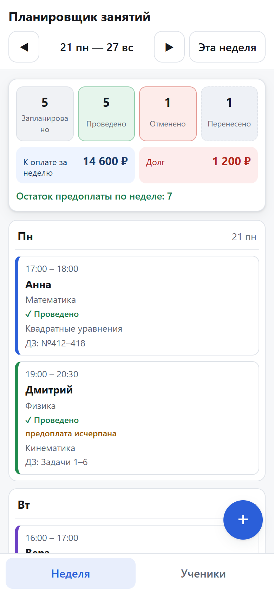
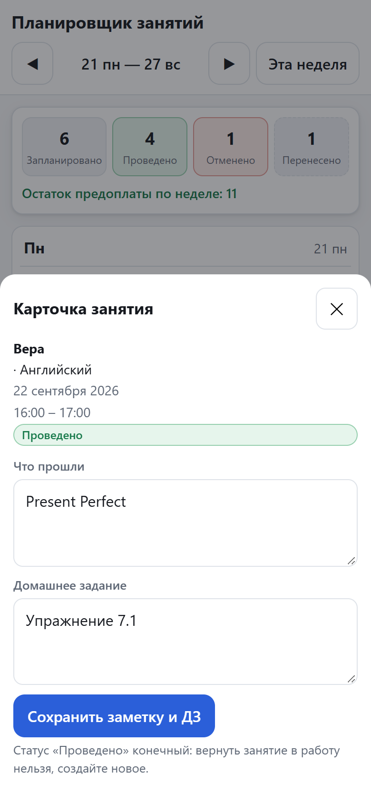
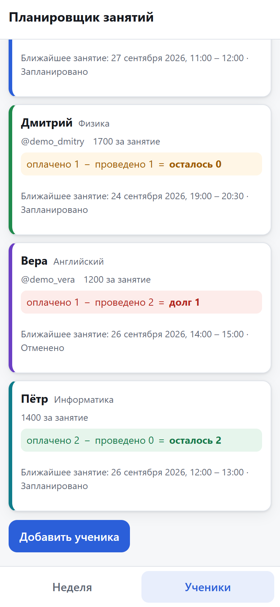
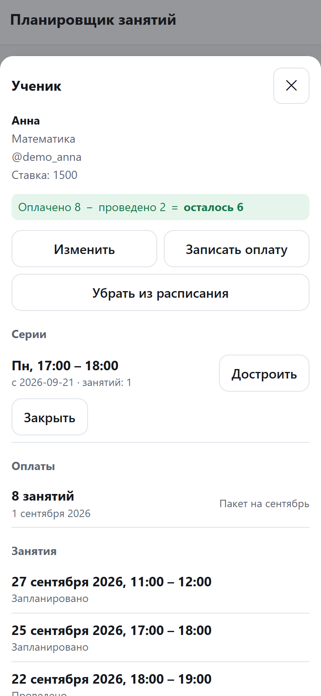
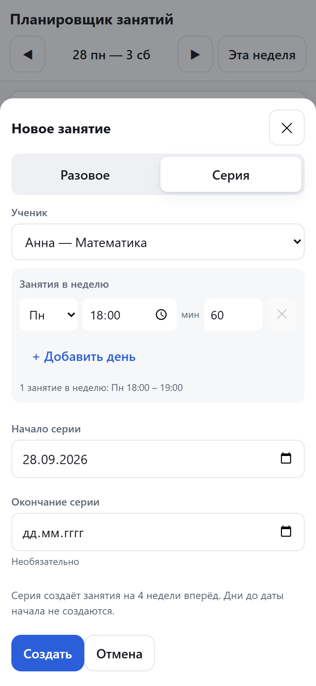
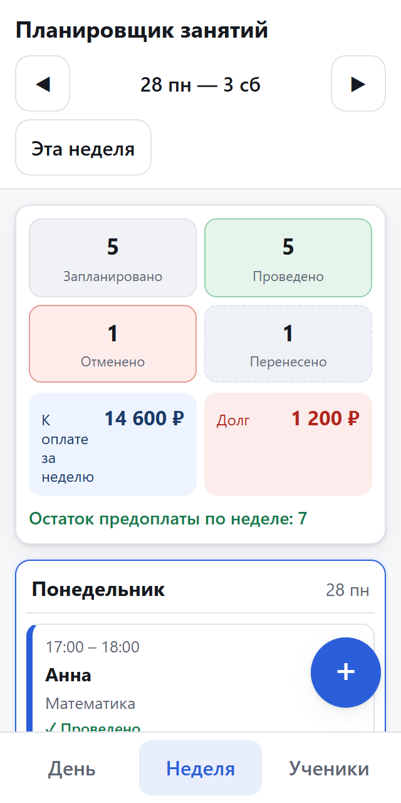
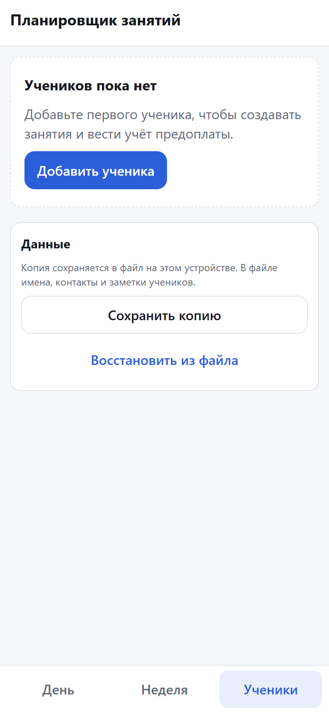

# Планировщик занятий репетитора

Кейс: мобильное веб-приложение для частного репетитора — недельное расписание
занятий, переносы без потери истории и учёт оплат. Работает без сервера и без
аккаунтов, все данные лежат в `localStorage` браузера.

**Открыть приложение:** https://ei2405ei-art.github.io/tutor-scheduler/

**Открыть без интернета и без сервера:** дважды щёлкните
[`index.html`](index.html) в корне репозитория — это самодостаточная сборка, все
данные приложения встроены в один файл.

## Что внутри кейса

- [`presentation.html`](presentation.html) — презентация кейса (10 слайдов, 16:9)
- [`presentation.pdf`](presentation.pdf) — то же для печати и отправки
- [`src/`](src) — само приложение
- [`tests/`](tests) — 169 проверок в 8 файлах
- [`ТЗ_MVP.md`](ТЗ_MVP.md) — спецификация MVP, 16 разделов с требованиями и журналом решений
- [`docs/screenshots/`](docs/screenshots) — интерфейс приложения

## Задача

Репетитор вёл расписание в заметках и мессенджерах. Переносы терялись, а вопрос
«кто и сколько должен» приходилось считать вручную. Нужно было одно место, где
видна неделя, а перенос занимает два касания и не стирает историю.

## Решение

| Задача репетитора | Как решено |
|---|---|
| Видеть, что сегодня | Стартовый экран — вкладка «День»: выбранная дата, занятия по времени, итог за день и ближайшее занятие |
| Видеть все занятия недели | Сетка рабочей недели Пн–Суб с заголовком диапазона дат, переключение недель |
| Не терять занятия на выходном | Воскресенье показано отдельным блоком под сеткой и входит в итог недели |
| Быстро переносить | Исходное занятие остаётся в своей ячейке со статусом «Перенесено», новое создаётся в целевой дате, оба знают друг друга |
| Не путаться в статусах | Статус различим подписью, цветом и паттерном, а не только цветом |
| Помнить, что прошли | Отметка «Проведено», заметка и домашнее задание в карточке занятия |
| Понимать деньги | Пакетная предоплата с историей, баланс и сумма к оплате считаются автоматически |
| Отличать пробное от платного | Флажок «Пробное занятие»: подпись в карточке, не входит в сумму к оплате и не списывает предоплату |
| Помнить, зачем занимается ученик | У ученика есть цель занятий и справочный часовой пояс |

## Как начать

1. Откройте «День» — это стартовая вкладка. Пока учеников нет, вместо пустого дня
   приложение показывает подсказку и кнопку добавления.
2. Добавьте ученика: имя, предмет, контакт, ставка за занятие, цель, часовой пояс,
   цвет. Кнопка есть и на «Дне», и на «Учениках».
3. Нажмите «+» в углу и создайте занятие: разовое или серию. Для первого
   знакомства есть флажок «Пробное занятие».
4. Расписание каждому ученику удобнее заводить из его карточки: вкладка
   «Ученики» → тап по ученику → «Создать серию». Ученик уже выбран, остаётся
   расписание. Одна серия — от одного до семи занятий в неделю: у каждого дня
   своё время и своя длительность. Например, понедельник и среда в 18:00,
   суббота в 12:00 — это одна серия в три занятия в неделю. День недели в серии
   нельзя выбрать дважды: если нужно два занятия в один день, добавьте вторую
   серию. В списке видно «Расписание: Пн 18:00 – 19:00, Сб 12:00 – 13:00» или
   «Расписание не задано».
5. Если слот уже занят, форма не исчезает: остаётся открытой, а внутри
   написано, кто и когда занимает это время. Поменяйте время или день недели
   и сохраните снова.
6. Занятие в «Дне» или в неделе нажимается: там отметка «Проведено», перенос,
   отмена, заметка и домашнее задание.
7. Оплаты и серии ученика — в его карточке на странице «Ученики».

### Как устроена неделя

Вкладка «Неделя» показывает рабочую неделю репетитора: шесть колонок с понедельника
по субботу, в каждой — время занятия, ученик и статус. Воскресенье вынесено
отдельным блоком под сеткой: занятия на выходном не теряются и входят в итог
недели вместе с остальными. Полные данные занятия — предмет, заметка, ДЗ — видны
в шторке по нажатию на карточку.

## Скриншоты

> Снимки пока относятся к прежней версии интерфейса: тогда вкладка «День» ещё не
> существовала, а приложение открывалось на «Неделе». После согласования нового
> интерфейса снимки будут пересняты скриптом `npm run screenshots`.

В приложении три вкладки: «День», «Неделя» и «Ученики». Три снимка ниже — это те
же страницы с открытой нижней шторкой (нажали на карточку или на кнопку «+»),
она закрывается жестом или клавишей Esc, отдельной страницы в навигации нет.

Все снимки сделаны в мобильном Chrome (390 px, а отдельно 320 px). Снимки с
демо-данными сняты на живом деплое, первый запуск — из локальной папочной сборки,
потому что это изменение ещё не опубликовано. Данные на снимках вымышленные:
имена и контакты не соответствуют реальным ученикам. Демо-набор — четыре ученика
и двенадцать занятий за неделю 21–27 сентября.

### Первый запуск: пустое расписание и где вводить данные

Так приложение выглядит, пока учеников нет. Отсюда прямо со стартовой страницы
можно добавить первого ученика.


Остальные снимки — с демо-данными. У вас после первого ученика неделя будет
такой: семь дней, в каждом занятия со временем, учеником и статусом, сегодняшний
день выделен. Данные лежат в вашем браузере и появляются только после добавления
ученика.

### Страница «Неделя»: статусы, итоги, сумма к оплате и долг



### «Неделя» + шторка занятия: заметка, ДЗ и действия



### Страница «Ученики»: баланс и ближайшее занятие



### «Ученики» + шторка ученика: серии, оплаты и занятия



### «Неделя» + шторка создания занятия в режиме серии



### Та же «Неделя» на ширине 320 px



### Пустое состояние «Учеников» — так приложение выглядит до добавления ученика



## Как считаются деньги

Баланс, сумма к оплате и долг — вычисляемые значения, в хранилище их нет:

- **Остаток предоплаты** = оплачено занятий − проведено занятий;
- **К оплате за неделю** = ставка ученика по всем занятиям недели в статусе
  «Запланировано» и «Проведено». Отменённые и перенесённые не входят, поэтому
  перенос попадает в сумму ровно один раз — в неделе новой даты;
- **Долг** = остаток × ставка, если остаток отрицательный.

Списывается только проведённое занятие, и только один раз: перенос и отмена
баланс не меняют.

## Технические решения

- **Стек:** браузерная PWA на HTML/JS + `localStorage`, публикация на GitHub
  Pages. Вариант с Python и Streamlit из брифа отклонён: сценарий на телефоне
  требует офлайн-работы, а стек преподавателей — 8–10 часов в неделю.
- **Слои:** `domain/` не знает про DOM, `storage/` — про интерфейс, `ui/` — про
  правила предметной области. Поэтому домен проверяется обычными юнит-тестами.
- **Данные:** версионированная схема. Повреждённые записи не удаляются молча,
  исходный JSON сохраняется в резервный слот.
- **Мобильность:** вёрстка от 320 px, зоны нажатия 44 px, состояние занятия
  различимо без зависимости только от цвета.
- **Прод:** относительные пути в сборке (`base: './'`), поэтому приложение
  работает в любом подкаталоге и не зависит от имени репозитория.
- **Два способа запуска:** опубликованная версия и `npm run dev` — полноценная
  PWA с офлайном и установкой на экран; `index.html` в корне репозитория —
  самодостаточная сборка, которая открывается из папки двойным щелчком. В ней
  работают и `localStorage`, и все функции приложения, но не работают service
  worker, офлайн-режим и установка: для них нужен `http(s)`. Данные папочной и
  веб-версий не общие, это разные источники браузера.

## Границы MVP

- Напоминания и push-уведомления не входят в MVP: в брифе они есть в
  результате, но отсутствуют в составе MVP.
- ИИ-модуль для домашних заданий выключен: он помечен «по желанию» и требует
  ключа API в открытом хранилище.
- Оплата ведётся пакетами занятий, а не почасово; длительность нужна для
  расписания и проверки пересечений.
- Данные хранятся только в этом браузере: очистка данных сайта удаляет их,
  синхронизации между устройствами нет.

## Запуск

Требуется Node.js `^22.22.2` или `^24.15.0` (или новее) и npm.

```bash
npm install        # установка зависимостей
npm run dev        # локальная разработка на http://localhost:5173
npm run build      # проверка типов, сборка в dist/ и папочная версия index.html
npm run preview    # просмотр собранной версии
npm run lint       # ESLint
npm run typecheck  # TypeScript без emit
npm run test       # Vitest
```

`npm run build` пересобирает и корневой `index.html`, поэтому после правок в
`src/` его нужно выполнить заново — иначе папочная версия останется старой.
Точка входа vite — [`app/index.html`](app/index.html), а не корневой
`index.html`: последний генерируется и править его вручную нельзя.

В PowerShell используйте `npm.cmd` вместо `npm`, если выполнение скриптов
заблокировано политикой исполнения.

## Публикация

```bash
npm run build
```

Workflow `.github/workflows/deploy-pages.yml` собирает проект и выкладывает
`dist/` через GitHub Actions.

---

**В кейсе:** Планировщик занятий репетитора

Код: [ei2405ei-art/tutor-scheduler](https://github.com/ei2405ei-art/tutor-scheduler)
